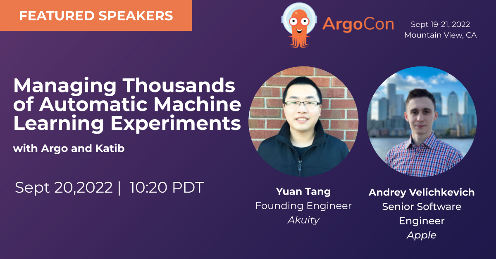

# Managing Thousands of Automatic Machine Learning Experiments With Argo and Katib

**Abstract**:

The fairly recent field of Automated Machine Learning (AutoML) provides the richness of powerful algorithms for model selection and hyperparameter (HP) tuning – one of the most important steps of the MLOps lifecycle. However, it’s non-trivial to advance these AutoML algorithms from research papers to production. ML engineers have to learn DevOps and cloud-native technologies to achieve that, but the main focus should be on inventing new ML algorithms. Katib and Argo open source projects provide an infrastructure to use and develop AutoML algorithms easily and fast in a cloud-native environment. In this talk, we will walk through the best practices (such as Argo caching and synchronization) for managing thousands of complex HP tuning experiments that bring the optimal performance. We will demonstrate how Argo Workflows and Katib bring the best of both worlds of Kubernetes-native workflow orchestration and HP tuning at scale. 

* [Schedule](https://sched.co/14lwz)
* [Slides](https://docs.google.com/presentation/d/11jFDjUhC1s6yCAPe_JtDUu4o-mYedsmR/edit?usp=sharing&ouid=114396299228948489624&rtpof=true&sd=true)
