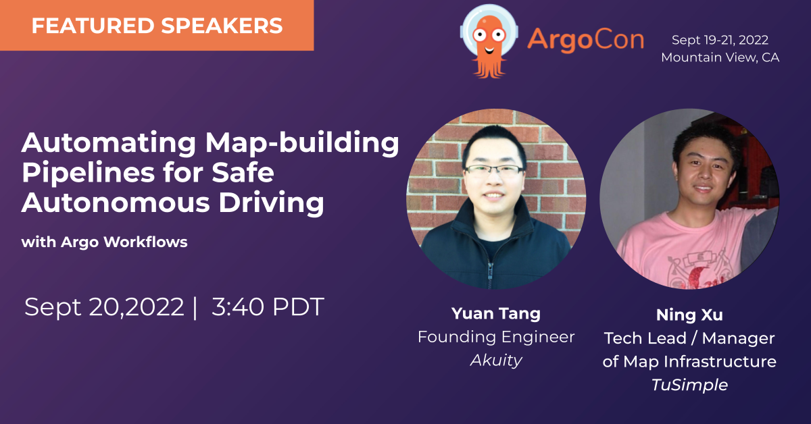

# Automating Map-building Pipelines for Safe Autonomous Driving with Argo Workflows at TuSimple

**Abstract**:

Autonomous driving has made tremendous progress in recent years. One of the fundamental challenges to achieving fully autonomous driving is map-building. In order to ensure that autonomous driving is as safe as possible, the map data has to be accurate, precise, and updated in real-time. In addition, the map-building process can be complex due to some steps that will need human involvement and making decisions based on how the workflow behaves. Argo Workflow is a cloud-native workflow orchestration engine that is critical to achieving these goals and grants us fine-grained control over the execution of workflows. In this talk, we will walk through the rich set of features and best practices of Argo Workflows that helped us to set up and execute complex map-building pipelines at TuSimple. 

* [Schedule](https://sched.co/14lxN)
* [Slides](https://docs.google.com/presentation/d/13D0s2VO3C0pMBJXdeQor0w9njex9nfGZ/edit?usp=sharing&ouid=114396299228948489624&rtpof=true&sd=true)
