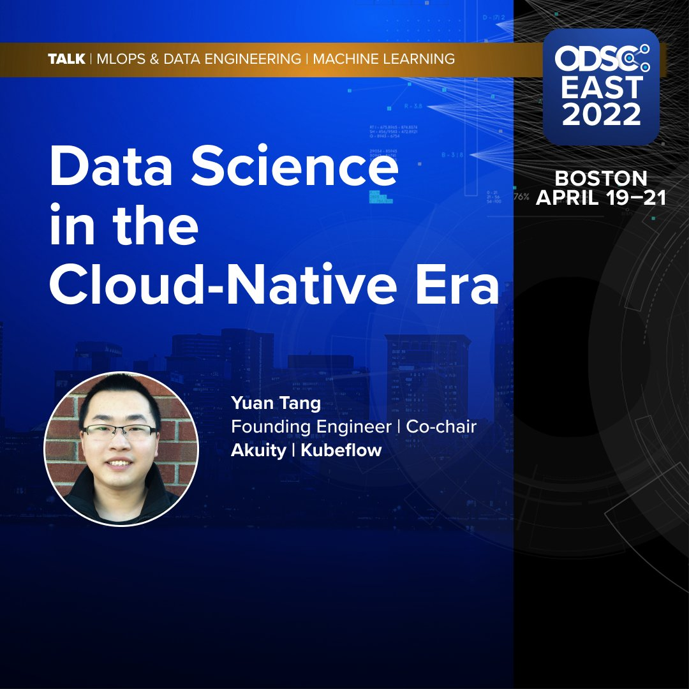

# Data Science in the Cloud-Native Era

**Abstract**:

In recent years, advances in data science have made tremendous progress yet designing large-scale data science and machine learning applications still remain challenging. The variety of machine learning frameworks, hardware accelerators, cloud vendors as well as the complexity of data science workflows brings new challenges to MLOps. It’s non-trivial for data scientists to easily launch, manage, monitor, and optimize their pipelines in a scalable way. On the other hand,  Kubernetes and containerization have revolutionized cloud applications in a manner not seen since Linux and virtualization's disruption of the server market. In this talk, we’ll provide an overview of the existing tools available and best practices to do MLOps effectively in the cloud-native era.
