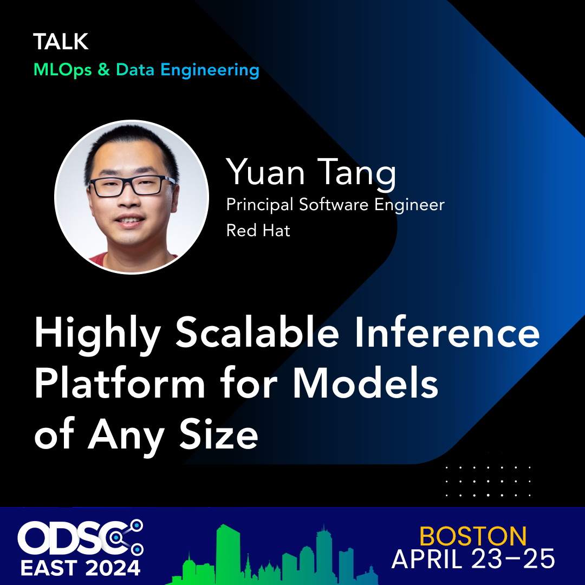

# Highly Scalable Inference Platform for Models of Any Size

**Abstract:**

In recent years, advances in ML/AI have made tremendous progress yet designing large-scale data science and machine learning applications still remain challenging. The variety of machine learning frameworks, hardware accelerators, cloud vendors as well as the complexity of data science workflows brings new challenges to MLOps. One particular challenge is that it’s non-trivial to build an inference system that’s suitable for models of different sizes, especially for LLMs or large models in general. 

This talk presents various best practices and challenges on building large, efficient, scalable, and reliable AI/ML model inference platforms using cloud-native technologies such as Kubernetes and KServe that are production-ready for models at any size.
